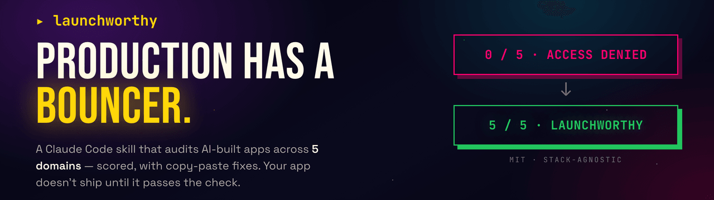

# launchworthy

[](https://github.com/wunderlandmedia/launchworthy/actions/workflows/validate.yml)

**A Claude Code skill that plays bouncer at the door of production. Your app doesn't get in front of real users until it passes the check.**

You built an app with Lovable, Bolt, v0, Cursor, or Claude Code. It works on your screen. This audits the five domains between "works for me" and "real users are paying for this and nothing is on fire," gives you a scored scorecard, and hands you a prioritized punch list with exact file paths and copy-paste fixes. The scorecard answers one question: is this app launchworthy yet?

It is stack-agnostic. It auto-detects your framework (Next.js, TanStack Start, SvelteKit, Svelte, Vite + React, Astro, Remix, and more) and your backend (Supabase, Firebase, Prisma, Directus, raw SQL) and adapts every check to what you actually use.

## Why not just ask Claude?

The fair first question, so it goes first. Claude already knows what RLS is, what a rate limiter looks like, and why secrets do not belong in a client bundle. The knowledge was never the gap. What a raw "review my code" session does not give you:

1. **The scope you did not know to ask for.** "Review my code" gets you a code review. It will not ask whether your backups have ever been restore-tested, whether error alerts actually reach you, whether you can roll back a bad deploy, or whether your domain registrar has 2FA. A third of this checklist is not in the code at all, and the person who most needs the audit is exactly the person who does not know to ask for those parts.
2. **A reviewer that refuses to reassure you.** A chat model's default is to be agreeable. This skill's contract is not: anything it cannot verify is `MANUAL CHECK NEEDED`, never a pass. A domain whose critical check is unverified is capped at WARN. Your own "yes, that's fine" is recorded as `reported by user, unverified`; it never turns green on its own. And when you say "it's just an MVP," it argues back instead of nodding along.
3. **The same rubric twice.** Ask a model to review your app twice and you get two differently shaped reviews. The fixed checklist, severities, and scoring rules are what make "0/5, fix the blockers, 5/5" a real progression you can watch, instead of vibes that shift every run.
4. **Judgment calls settled in advance.** Generic AI reviews routinely flag the Supabase anon key in the bundle (a false positive, it is public by design) while missing that RLS is off (the actual critical). The handful of calls where unguided output is least consistent are hardcoded here.

Claude brings the intelligence. This skill brings the discipline: refuse to mark safe what it cannot see, argue back when you rationalize, and score the same way every time.

## Why another hardening tool

Most "production checklist" content tells you *that* you have a gap and stops there. This is built for one specific person: someone who shipped an app with an AI tool, does not have a security background, and does not know what they do not know. So it does four things a generic checklist does not:

1. **It knows your exact stack's failure modes.** The number one critical bug in AI-built apps is a Supabase table with row-level security turned off, or a Firebase database still in test mode. This skill knows the difference between "the anon key is in the bundle" (fine, by design) and "RLS is off" (critical), so it flags the real problem instead of the fake one.
2. **It hands you the fix, not just the finding.** Every major gap has a playbook with the actual code: the `create policy` statements, the rate-limiter, the validation schema, the security headers for your framework. Copy, paste, adapt.
3. **It argues back when you rationalize.** "It's just an MVP," "I'll add auth later," "no one will find it." The skill has a counter for each, because the excuses that feel most reasonable are the ones that get people breached.
4. **It interviews you about what code can't show, then verifies your answers.** Reading code cannot tell you whether your live site leaks a key, whether user A can read user B's data, or whether a backup has ever been restored. After the scorecard, the skill asks a short set of questions built from your actual code, and it asks for evidence (paste this command's output, this response, this search result), not a checkbox you tick yourself. It reads the evidence and moves your score. The checks it cannot see are the ones that matter most, and this is how they get resolved instead of guessed.

## The five domains

| # | Domain | What it catches |
|---|---|---|
| 1 | Frontend & Experience | White screens, missing loading/empty states, broken responsive, a11y gaps |
| 2 | Backend & Data | DB or admin keys reachable from the browser, no input validation, no connection pooling, N+1 queries, unguarded AI calls |
| 3 | Auth & Security | Supabase RLS off, open Firebase rules, "user A can read user B," secrets in the bundle, no rate limit on your paid AI endpoint |
| 4 | Infrastructure & Deployment | One environment, no rollback, no health check, no CI, no CDN |
| 5 | Operations & Recovery | No error tracking, no backups, untested restores, can you rebuild in under an hour |

Full check list: [`skills/launchworthy/references/checklist.md`](skills/launchworthy/references/checklist.md).

## What the output looks like

A scored scorecard plus a punch list ranked by urgency, written to `tmp/hardening-<project>-<date>.md`. See a full example: [`examples/sample-report.md`](examples/sample-report.md).

```
## Scorecard

| # | Domain                       | Score | Findings                          |
|---|------------------------------|-------|-----------------------------------|
| 1 | Frontend & Experience        | WARN  | 0 crit, 1 high, 2 med, 1 low      |
| 2 | Backend & Data               | WARN  | 0 crit, 1 high, 1 med, 0 low      |
| 3 | Auth & Security              | FAIL  | 2 crit, 2 high, 0 med, 0 low      |
| 4 | Infrastructure & Deployment  | WARN  | 0 crit, 1 high, 1 med, 0 low      |
| 5 | Operations & Recovery        | FAIL  | 0 crit, 3 high, 1 med, 0 low      |

Overall: 0/5 domains passing. 2 critical, 8 high, 5 medium, 1 low.
```

## Quickstart

If you have never used a terminal before, this is the whole journey, start to finish. It takes about ten minutes.

**1. Get your code onto your computer.**
If you built in Lovable, Bolt, or v0, connect the project to GitHub (each has a "connect to GitHub" or "export" button), then clone it:

```bash
git clone https://github.com/your-username/your-app.git
cd your-app
```

If you built in Cursor or Claude Code, your code is already on your machine. Just open a terminal in that folder.

**2. Install Claude Code** (skip if you already have it): follow the guide at [claude.com/claude-code](https://claude.com/claude-code), then run `claude` in your project folder.

**3. Install this plugin.** Inside Claude Code, type these two lines:

```
/plugin marketplace add wunderlandmedia/launchworthy
/plugin install launchworthy@wunderlandmedia
```

That is a one-time setup. The plugin is now available in every project you ever open.

**4. Ask for the audit.** Just say what you want in plain English:

> Is my app production ready?

Claude detects your stack, runs the audit, and writes a scored report to `tmp/`. Then it offers to fix the safe things for you.

## Everyday use

Once installed, you never touch the install commands again. From any project, just ask:

> Is this app production ready? Harden it.
> Will this survive real users? Audit it.
> Is my Supabase secure?

(Or run the skill directly with `/launchworthy:launchworthy`. The plain-English phrasing is easier to remember and works just as well.)

Claude detects your stack, runs the audit, writes the scored report, and offers to apply the safe fixes, with your confirmation and only on a clean git state.

**Then run it again.** The report is scored, so the fastest way to feel progress is to fix the blockers and re-run. Watch it climb: `0/5 domains passing` with two criticals, fix them with the playbooks, ask again, and see `4/5`. That loop, fix then re-check, is the point. Keep going until you are green.

## What's in the box

```
launchworthy/                         # a Claude Code plugin + marketplace
├── .claude-plugin/
│   ├── marketplace.json              # so /plugin marketplace add works
│   └── plugin.json                   # plugin identity
├── skills/
│   └── launchworthy/
│       ├── SKILL.md                  # the audit workflow
│       └── references/
│           ├── checklist.md          # all checks, 5 domains
│           ├── report-template.md    # saved report format
│           ├── presentation.md       # terminal output format (the on-screen scorecard)
│           ├── evidence-interview.md # the post-scorecard questions, evidence not attestation
│           ├── rationalizations.md   # counters for "it's just an MVP" etc.
│           └── fixes/                # copy-paste remediation, loaded only when fixing
│               ├── supabase-rls.md
│               ├── firebase-rules.md
│               ├── auth-ownership.md
│               ├── rate-limiting.md
│               ├── security-headers.md
│               ├── input-validation.md
│               └── error-tracking.md
├── examples/sample-report.md
├── scripts/check-links.py             # CI: every skill reference link resolves
├── .github/workflows/validate.yml     # CI: link check + `claude plugin validate`
├── README.md
└── LICENSE
```

The fix playbooks load only when you ask Claude to actually fix something, so the audit itself stays fast and cheap on tokens.

### Prefer to copy the folder instead?

You do not have to use the plugin system. The skill is just files, so you can copy `skills/launchworthy/` straight into `~/.claude/skills/` (user-level, available everywhere) or your project's `.claude/skills/`. The plugin route is only there to save you from finding that directory by hand.

## What it will and will not do

It reads your code and finds the common, expensive production gaps. It will offer to apply safe fixes (error boundaries, loading states, security headers, input validation), but only after you confirm and only when your changes are committed so everything is reversible.

It will not touch your secrets, your database settings, or your DNS. Those are reported with exact manual steps, because rotating a leaked key or writing an RLS policy against live data is your call, not a guess a script should make.

It is an audit, not a penetration test. Passing all five domains means you are no longer an easy target, not that you are unhackable.

## License

MIT. It is a plain-text skill. Fork it, adapt it, ship it.

## Credit

Built by [Kemal Esensoy](https://wunderlandmedia.com) at Wunderlandmedia, a one-person web development and SEO studio that spends a lot of time turning half-finished apps into real ones. If you would rather have a human do the hardening, that is the day job.
